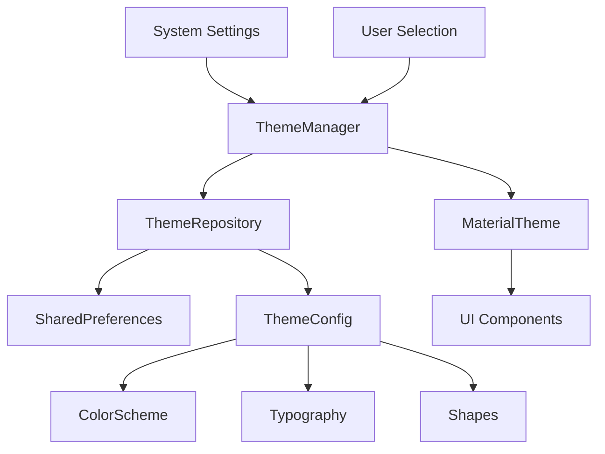

# Theme Design System - Design Document

## Overview

The WellTrack theme design system will implement a comprehensive theming solution using Material Design 3 (M3) principles with Jetpack Compose. The system will provide multiple wellness-focused themes, support dynamic color adaptation, and ensure consistent visual experience across all app features. The design leverages Material You's dynamic color system while offering curated theme options that align with health and wellness aesthetics.

## Architecture

### Theme Management Architecture



The architecture follows a centralized theme management pattern where:

- `ThemeManager` coordinates theme selection and application
- `ThemeRepository` handles persistence and theme data management
- Material Design 3 `MaterialTheme` provides the theming foundation
- Theme configurations define color schemes, typography, and shapes

### Component Integration

All existing UI components (meal planning, shopping lists, meal prep, recipes) will automatically inherit theme changes through the Material Design 3 theming system without requiring individual component modifications.

## Components and Interfaces

### Core Theme Components

#### 1. ThemeManager

```kotlin
class ThemeManager(
    private val themeRepository: ThemeRepository,
    private val context: Context
) {
    fun getCurrentTheme(): Flow<WellTrackTheme>
    fun setTheme(theme: WellTrackTheme)
    fun getAvailableThemes(): List<WellTrackTheme>
    fun shouldUseDynamicColor(): Boolean
}
```

#### 2. WellTrackTheme Enum

```kotlin
enum class WellTrackTheme(
    val displayName: String,
    val description: String,
    val previewColors: ThemePreviewColors
) {
    SYSTEM_DEFAULT("System Default", "Follows device theme"),
    NATURE_HARMONY("Nature Harmony", "Earth tones and greens"),
    CALM_WATERS("Calm Waters", "Soothing blues and soft tones"),
    ENERGIZING_SUNRISE("Energizing Sunrise", "Warm and vibrant colors"),
    DYNAMIC("Dynamic", "Adapts to wallpaper colors")
}
```

#### 3. Theme Configuration

```kotlin
data class ThemeConfig(
    val lightColorScheme: ColorScheme,
    val darkColorScheme: ColorScheme,
    val typography: Typography,
    val shapes: Shapes
)
```

### Theme Settings UI Components

#### 1. ThemeSelectionScreen

- Grid layout displaying theme options with preview cards
- Real-time preview functionality
- Apply/Cancel actions
- Theme descriptions and names

#### 2. ThemePreviewCard

- Miniature representation of key UI elements
- Shows primary, secondary, and surface colors
- Displays sample text in theme typography
- Interactive selection state

#### 3. ThemePreviewDialog

- Full-screen preview of selected theme
- Sample screens showing navigation, cards, buttons
- Confirmation and cancellation options

## Data Models

### Theme Persistence Model

```kotlin
data class UserThemePreferences(
    val selectedTheme: WellTrackTheme,
    val useDynamicColor: Boolean,
    val followSystemTheme: Boolean,
    val lastModified: Long
)
```

### Theme Preview Model

```kotlin
data class ThemePreviewColors(
    val primary: Color,
    val secondary: Color,
    val tertiary: Color,
    val surface: Color,
    val background: Color
)
```

## Wellness-Focused Color Schemes

### Nature Harmony Theme

- **Primary**: Forest Green (#2E7D32)
- **Secondary**: Sage Green (#689F38)
- **Tertiary**: Earth Brown (#5D4037)
- **Surface**: Soft Cream (#F1F8E9)
- **Background**: Pure White (#FFFFFF)

### Calm Waters Theme

- **Primary**: Ocean Blue (#1976D2)
- **Secondary**: Sky Blue (#42A5F5)
- **Tertiary**: Teal Accent (#00ACC1)
- **Surface**: Light Blue (#E3F2FD)
- **Background**: Off White (#FAFAFA)

### Energizing Sunrise Theme

- **Primary**: Warm Orange (#FF6F00)
- **Secondary**: Coral Pink (#FF7043)
- **Tertiary**: Golden Yellow (#FFC107)
- **Surface**: Warm Cream (#FFF8E1)
- **Background**: Pure White (#FFFFFF)

Each theme includes comprehensive light and dark variants with appropriate contrast ratios for accessibility compliance.

## Error Handling

### Theme Loading Errors

- Fallback to system default theme if custom theme fails to load
- Error logging for theme application failures
- Graceful degradation to Material Design defaults

### Dynamic Color Unavailability

- Automatic fallback to static color schemes on Android < 12
- User notification when dynamic color is not supported
- Seamless transition between dynamic and static themes

### Theme Persistence Errors

- Default theme selection if preferences cannot be loaded
- Retry mechanism for theme preference saving
- Error recovery without app restart

## Testing Strategy

### Unit Testing

- Theme manager logic and theme switching
- Color scheme generation and validation
- Theme preference persistence and retrieval
- Dynamic color availability detection

### UI Testing

- Theme application across all screens
- Theme preview functionality
- Theme selection user interactions
- Visual consistency across components

### Integration Testing

- Theme integration with existing features
- System theme change handling
- Dynamic color integration
- Theme persistence across app restarts

### Accessibility Testing

- Color contrast ratio validation for all themes
- Text readability in different themes
- Focus indicators and touch targets
- Screen reader compatibility

## Performance Considerations

### Theme Switching Performance

- Lazy loading of theme configurations
- Efficient color scheme caching
- Minimal recomposition during theme changes
- Optimized theme preview generation

### Memory Management

- Theme configuration caching strategy
- Efficient color object reuse
- Preview image generation optimization
- Memory cleanup for unused themes

## Implementation Notes

### Material Design 3 Integration

- Full utilization of M3 color system and tokens
- Dynamic color support for Android 12+
- Proper implementation of color roles (primary, secondary, tertiary)
- Typography and shape system integration

### Compose Integration

- Theme provider at app root level
- Automatic component theming through MaterialTheme
- Efficient recomposition handling
- Theme-aware custom components

### Backward Compatibility

- Support for Android API 21+
- Graceful degradation of dynamic color features
- Consistent theming across different Android versions
- Fallback mechanisms for unsupported features
