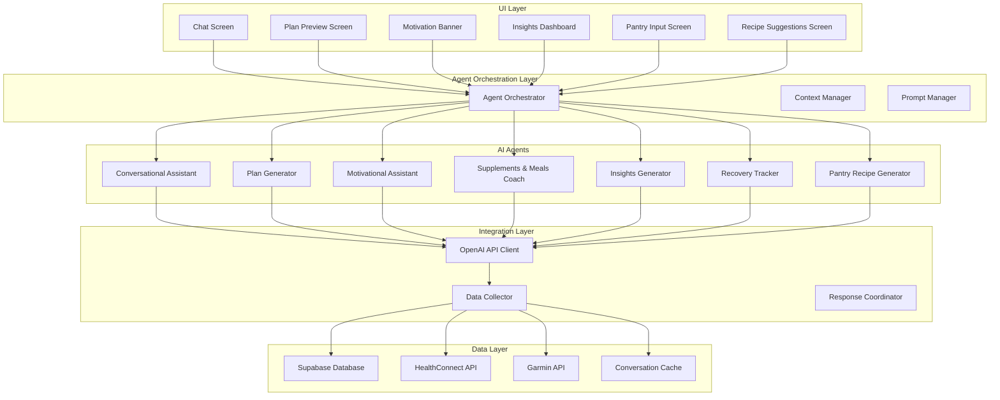
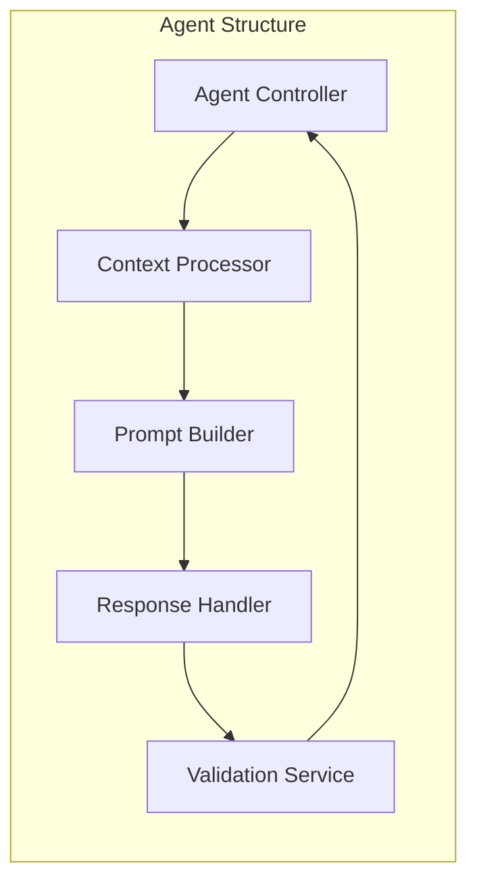

# Design Document

## Overview

The GPT Agent Integration system introduces a comprehensive AI-powered coaching and assistance layer to the WellTrack app. The system consists of 7 specialized agents that work together to provide personalized health guidance, meal planning, supplement coaching, motivational support, and data insights. The architecture leverages OpenAI's GPT models, integrates with the existing Supabase backend, and provides both conversational and automated AI features.

## Architecture

### High-Level Architecture



### Agent Architecture Pattern

Each agent follows a consistent architecture pattern:



## Components and Interfaces

### 1. Agent Orchestrator

**Purpose**: Central coordinator for all AI agents, manages agent selection, context sharing, and response coordination.

**Key Responsibilities**:

- Route requests to appropriate agents
- Manage inter-agent communication
- Handle agent priority and fallback logic
- Coordinate multi-agent workflows

**Interface**:

```kotlin
interface AgentOrchestrator {
    suspend fun processRequest(request: AgentRequest): AgentResponse
    suspend fun routeToAgent(agentType: AgentType, context: AgentContext): AgentResponse
    suspend fun coordinateMultiAgentTask(task: MultiAgentTask): List<AgentResponse>
}
```

### 2. Context Manager

**Purpose**: Manages user context, conversation history, and data aggregation for AI agents.

**Key Responsibilities**:

- Aggregate user data from multiple sources
- Maintain conversation context and memory
- Provide relevant context to agents
- Handle context privacy and security

**Interface**:

```kotlin
interface ContextManager {
    suspend fun getUserContext(userId: String): UserContext
    suspend fun getConversationHistory(userId: String, limit: Int): List<ConversationEntry>
    suspend fun updateContext(userId: String, updates: ContextUpdate)
    suspend fun clearSensitiveContext(userId: String)
}
```

### 3. Individual Agent Interfaces

#### Conversational Assistant Agent

```kotlin
interface ConversationalAssistant {
    suspend fun processMessage(message: String, context: UserContext): ConversationResponse
    suspend fun suggestActions(context: UserContext): List<ActionSuggestion>
    suspend fun handleFollowUp(previousResponse: String, followUp: String): ConversationResponse
}
```

#### Plan Generator Agent

```kotlin
interface PlanGenerator {
    suspend fun generateMealPlan(preferences: MealPreferences, context: UserContext): MealPlan
    suspend fun generateWorkoutPlan(goals: FitnessGoals, context: UserContext): WorkoutPlan
    suspend fun generateSupplementPlan(deficiencies: List<Nutrient>, context: UserContext): SupplementPlan
    suspend fun adjustPlanBasedOnProgress(planId: String, progress: ProgressData): PlanAdjustment
}
```

#### Motivational Assistant Agent

```kotlin
interface MotivationalAssistant {
    suspend fun generateDailyMotivation(context: UserContext): MotivationalMessage
    suspend fun generateWeeklyReflection(weekData: WeeklyProgressData): WeeklyReflection
    suspend fun handleSetback(setbackData: SetbackData): MotivationalResponse
}
```

### 4. OpenAI Integration Client

**Purpose**: Handles all communication with OpenAI APIs, including prompt management, response parsing, and error handling.

**Key Features**:

- GPT-4 Turbo and GPT-3.5 Turbo support
- Function calling for structured responses
- Rate limiting and retry logic
- Cost optimization and token management

**Interface**:

```kotlin
interface OpenAIClient {
    suspend fun generateResponse(prompt: String, model: GPTModel, functions: List<Function>?): GPTResponse
    suspend fun generateStructuredResponse<T>(prompt: String, responseType: Class<T>): T
    suspend fun streamResponse(prompt: String, onChunk: (String) -> Unit): GPTResponse
}
```

### 5. Data Collector

**Purpose**: Aggregates data from multiple sources to provide comprehensive context to AI agents.

**Data Sources**:

- Supabase: User profiles, meal logs, supplement logs, goals
- HealthConnect: Steps, heart rate, sleep, weight
- Garmin: Advanced fitness metrics, recovery data
- App usage: Feature usage patterns, preferences

**Interface**:

```kotlin
interface DataCollector {
    suspend fun collectUserHealthData(userId: String): HealthDataSnapshot
    suspend fun collectNutritionData(userId: String, days: Int): NutritionSnapshot
    suspend fun collectFitnessData(userId: String, days: Int): FitnessSnapshot
    suspend fun collectGoalProgress(userId: String): GoalProgressSnapshot
}
```

## Data Models

### Core Data Models

```kotlin
data class UserContext(
    val userId: String,
    val profile: UserProfile,
    val preferences: UserPreferences,
    val currentGoals: List<Goal>,
    val recentActivity: ActivitySummary,
    val healthMetrics: HealthMetrics,
    val conversationHistory: List<ConversationEntry>
)

data class AgentRequest(
    val agentType: AgentType,
    val requestType: RequestType,
    val payload: Map<String, Any>,
    val context: UserContext,
    val priority: Priority = Priority.NORMAL
)

data class AgentResponse(
    val agentType: AgentType,
    val responseType: ResponseType,
    val content: String,
    val structuredData: Map<String, Any>? = null,
    val actionSuggestions: List<ActionSuggestion> = emptyList(),
    val followUpQuestions: List<String> = emptyList()
)

data class ConversationEntry(
    val id: String,
    val userId: String,
    val message: String,
    val response: String,
    val agentType: AgentType,
    val timestamp: Long,
    val context: Map<String, Any>
)
```

### Agent-Specific Models

```kotlin
data class MealPlan(
    val id: String,
    val userId: String,
    val startDate: LocalDate,
    val endDate: LocalDate,
    val meals: List<PlannedMeal>,
    val nutritionalSummary: NutritionalSummary,
    val adjustmentReasons: List<String>
)

data class MotivationalMessage(
    val id: String,
    val userId: String,
    val message: String,
    val type: MotivationType,
    val personalizedElements: List<String>,
    val actionPrompt: String?
)

data class RecipeSuggestion(
    val id: String,
    val name: String,
    val ingredients: List<Ingredient>,
    val instructions: List<String>,
    val nutritionalInfo: NutritionalInfo,
    val matchScore: Float,
    val cookingTime: Int,
    val difficulty: DifficultyLevel
)
```

## Error Handling

### Error Categories

1. **API Errors**: OpenAI API failures, rate limiting, network issues
2. **Data Errors**: Missing user data, invalid context, data inconsistencies
3. **Agent Errors**: Agent-specific failures, prompt issues, response parsing errors
4. **System Errors**: Database failures, authentication issues, configuration problems

### Error Handling Strategy

```kotlin
sealed class AgentError : Exception() {
    data class APIError(val code: Int, val message: String) : AgentError()
    data class DataError(val field: String, val issue: String) : AgentError()
    data class AgentError(val agentType: AgentType, val error: String) : AgentError()
    data class SystemError(val component: String, val error: String) : AgentError()
}

interface ErrorHandler {
    suspend fun handleError(error: AgentError, context: ErrorContext): ErrorResponse
    suspend fun logError(error: AgentError, context: ErrorContext)
    suspend fun shouldRetry(error: AgentError): Boolean
}
```

### Fallback Mechanisms

1. **Agent Fallback**: If primary agent fails, route to backup agent
2. **Response Fallback**: Provide pre-defined responses for common scenarios
3. **Graceful Degradation**: Reduce functionality rather than complete failure
4. **User Notification**: Inform users of limitations when services are unavailable

## Testing Strategy

### Unit Testing

1. **Agent Logic Testing**: Test individual agent response generation
2. **Context Management Testing**: Verify context aggregation and privacy
3. **API Integration Testing**: Mock OpenAI responses and test parsing
4. **Error Handling Testing**: Test all error scenarios and fallbacks

### Integration Testing

1. **End-to-End Agent Workflows**: Test complete user interactions
2. **Multi-Agent Coordination**: Test agent handoffs and collaboration
3. **Data Integration Testing**: Test data collection from all sources
4. **Performance Testing**: Test response times and resource usage

### User Acceptance Testing

1. **Conversation Quality**: Test naturalness and helpfulness of responses
2. **Personalization Accuracy**: Verify recommendations match user context
3. **Feature Discovery**: Test how well agents guide users to app features
4. **Error Recovery**: Test user experience when errors occur

### Testing Framework

```kotlin
@TestInstance(TestInstance.Lifecycle.PER_CLASS)
class ConversationalAssistantTest {

    @Mock
    private lateinit var openAIClient: OpenAIClient

    @Mock
    private lateinit var contextManager: ContextManager

    private lateinit var conversationalAssistant: ConversationalAssistant

    @Test
    fun `should generate appropriate response for meal planning request`() = runTest {
        // Given
        val userContext = createMockUserContext()
        val message = "I want to plan healthy meals for this week"

        // When
        val response = conversationalAssistant.processMessage(message, userContext)

        // Then
        assertThat(response.content).contains("meal plan")
        assertThat(response.actionSuggestions).isNotEmpty()
    }
}
```

## Security and Privacy

### Data Privacy

1. **Context Isolation**: User contexts are isolated and encrypted
2. **Conversation Encryption**: All conversation data encrypted at rest
3. **Data Minimization**: Only necessary data sent to OpenAI
4. **Retention Policies**: Automatic cleanup of old conversation data

### API Security

1. **API Key Management**: Secure storage and rotation of OpenAI keys
2. **Rate Limiting**: Prevent abuse and manage costs
3. **Request Validation**: Validate all inputs before processing
4. **Response Sanitization**: Clean and validate all AI responses

### User Control

1. **Conversation History**: Users can view and delete conversation history
2. **Data Sharing Preferences**: Users control what data is used for AI
3. **Agent Disable**: Users can disable specific agents
4. **Privacy Dashboard**: Transparent view of AI data usage

## Performance Considerations

### Response Time Optimization

1. **Context Caching**: Cache frequently accessed user context
2. **Prompt Optimization**: Optimize prompts for faster responses
3. **Parallel Processing**: Process multiple agent requests concurrently
4. **Response Streaming**: Stream responses for better perceived performance

### Cost Management

1. **Model Selection**: Use appropriate model for each task (GPT-3.5 vs GPT-4)
2. **Token Optimization**: Minimize token usage in prompts and responses
3. **Caching Strategy**: Cache common responses to reduce API calls
4. **Usage Monitoring**: Track and alert on API usage and costs

### Scalability

1. **Agent Pool Management**: Manage agent instances for concurrent users
2. **Database Optimization**: Optimize queries for context retrieval
3. **Background Processing**: Process non-urgent tasks asynchronously
4. **Load Balancing**: Distribute agent requests across multiple instances
